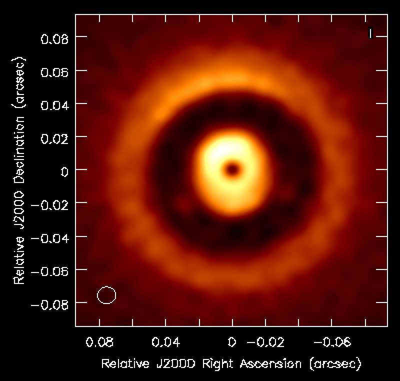
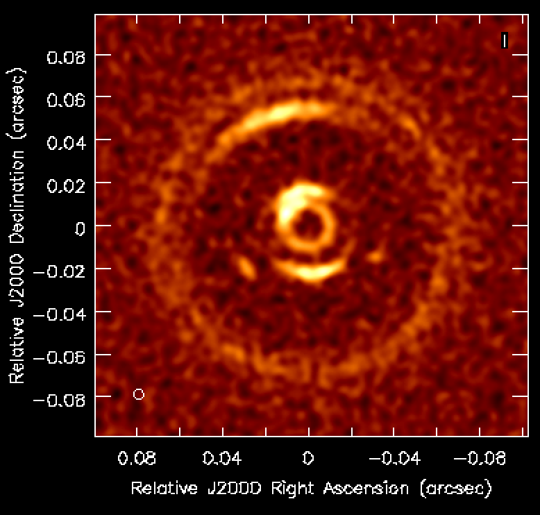

# Hydrodynamic models used in the ngVLA paper

M_P | r_P [AU] | alpha | Disk mass (Msun) | Surface density | ALMA 0.87mm | ngVLA 3mm
:---:|:---:|:---:|:---:|:---:|:---:|:---:
Jupiter | 5 | 1e-5 | 0.006 | [dust](data/Jupiter/5_0.006_ExpDisk/surfdensdust.dat) [gas](data/Jupiter/5_0.006_ExpDisk/surfdens.dat) |  | 
